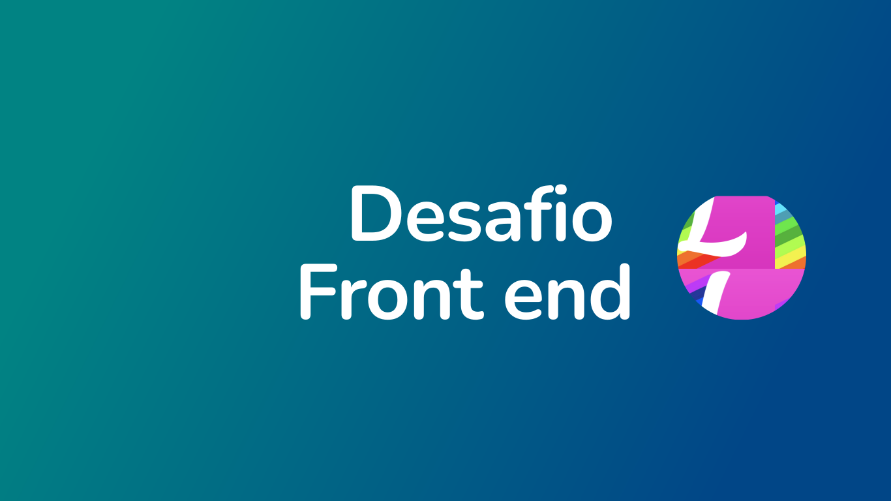

# Desafio Front-End Lacrei

Página desenvolvida como parte do processo seletivo para participar do programa de voluntariado da Lacrei, uma plataforma segura e acolhedora para comunidade LGBTQIAPN+.

## 🎯 Objetivo do desafio

Avaliar sua capacidade de escrever código limpo, bem estruturado e reutilizável.

## 📝 Tarefas

1. Replicar layout de acordo com figma
2. Executar navegação entre as telas
3. Fazer deploy da aplicação

## ⚙ Ferramentas requeridas

1. React, Gatsby ou Next.js
2. Styled-components

## 👩‍💻 Aspectos técnicos

Todas as ferramentas listadas anteriormente são mandatórias, além delas sinta-se livre para utilizar de qualquer outra tecnologia.

## 🔝 Bônus

1. Entregar uma aplicação responsiva
2. Utilizar TypeScript
3. Implementar testes

## 🔧 Tecnologias Utilizadas

- TSX
- Typescript
- React
- Styled Components
- React Router DOM
- Phosphor React

## 🔗 Deploy

Para acessar meu deploy, basta <a href="#">clicar aqui</a>!
